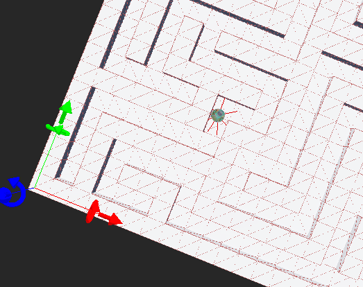

# Proyecto Final ICI4150-1 Robótica y Sistemas Autónomos
## Profesora: Sandra Cano
## Integrantes: Daniel Cornejo, Ian Guerrero, Isidora Osorio
## Línea elegida: Planificación de rutas
## Objetivo del proyecto
El presente proyecto tiene la finalidad de crear un robot diferencial e-puck con un controlador en Python capaz de seguir una ruta premeditada en una arena del entorno Webots con distintos tipos de obstáculos, el robot debe ser capaz de sobrepasar los obstáculos y seguir la ruta desde inicio a final sin trabarse en los susodichos. Esto se logrará gracias a una robusta implementación de un controlador complejo en el lenguaje de programación de Python que permitirá al robot e-puck sobrepasar los obstáculos gracias a los distintos sensores que posee el robot se puede realizar estimaciones para los movimientos que debe seguir este, como se verá mas adelante en las explicaciones de los distintos sensores y los algoritmos que sigue el robot para tomar distancias y moverse en la arena.

## Descripción del robot, sensores y actuadores utilizados
A continuación se presentan distintos datos del robot e-puck que son relevantes. Para el desarrollo de este proyecto se utilizó el simulador Webots modelando un robot e-puck, el cual cuenta con una configuración de tracción diferencial. A continuación, se detallan sus características físicas, así como los sensores y actuadores que se habilitaron en el controlador para resolver la navegación en el laberinto.

### 1. Características Físicas y Cinemáticas
El modelo cinemático del robot está configurado con las siguientes dimensiones físicas fundamentales para el cálculo de la odometría
- **Radio de las ruedas**: 0.0205m.
- **Distancia entre las ruedas**: 0.052m.
- **Velocidad máxima de los motores**: 6.28rad/s.

### 2. Actuadores
El movimiento del robot se logra mediante dos motores de corriente continua (DC) independientes, uno para cada rueda. Los motores de las ruedas izquierda y derecha actúan bajo control de velocidad (setVelocity). Durante la navegación normal, la velocidad base se ajusta a un 40% de la capacidad máxima (aprox. 2.51 rad/s) para el avance, y un 20% (aprox. 1.25 rad/s) durante las rutinas de rotación para asegurar precisión. En situaciones de evasión, los motores invierten su giro al 50% de su capacidad.

### 3. Sensores
Para lograr una navegación autónoma y conocer el estado interno y externo del robot, el controlador hace uso de dos tipos de sensores principales

- **Sensores de posición (encoders)**: Se habilitaron los sensores angulares de ambas ruedas (left wheel sensor y right wheel sensor). Son esenciales para la odometría. El controlador calcula la variación del ángulo de giro en cada iteración del simulador para estimar el desplazamiento lineal ($\Delta s$) y la rotación del chasis ($\Delta \phi$). Esto permite mantener un seguimiento continuo de la posición global del robot ($x$, $y$, $\theta$) respecto a su punto de inicio.
- **Sensores de proximidad (infrarrojos)**: El e-puck cuenta con un anillo de 8 sensores infrarrojos (ps0 a ps7), los cuales se habilitaron en su totalidad, aunque el algoritmo de control focaliza su toma de decisiones en cuatro de ellos:
  - Sensores frontales (ps7 y ps0): Se utilizan para detectar peligro de colisión inminente (obstáculos de frente). Si el valor de lectura supera el umbral de 400.0, el robot pasa a un estado de evasión rápida.
  - Sensores laterales (ps6 izquierdo y ps1 derecho): Sirven para la corrección de trayectoria. Si la lectura supera el umbral de 150.0 (indicando demasiada cercanía a una pared del laberinto), el controlador inyecta una     corrección en las velocidades de las ruedas para mantener al robot centrado en el pasillo.

### 4. Lógica de control
El controlador implementa una arquitectura híbrida:

- **Planificación Global**: Al iniciar, transforma la matriz del laberinto utilizando el algoritmo A* para calcular la ruta óptima desde el punto de inicio hasta la meta. Los nodos lógicos se mapean a coordenadas físicas exactas (waypoints).
- **Control Local (Máquina de Estados)**: El robot alterna entre tres estados de navegación:
  - Rotando: Gira sobre su propio eje hasta alinearse con el ángulo del siguiente waypoint (con una tolerancia de 0.08 radianes).
  - Avanzando: Se desplaza hacia el waypoint utilizando un control Proporcional (Kp = 2.0) sobre el error angular para ajustar el rumbo dinámicamente, al mismo tiempo que suma o resta velocidades si detecta paredes laterales.
  - Evadiendo: Rutina de emergencia que interrumpe la navegación normal para evitar choques inminentes mediante giros bruscos.

## Descripción de los escenarios de prueba 
En esta sección se presentan detalladamente los escenarios de prueba en el entorno de Webots . . .

## Explicación del algoritmo utilizado
Para seguir con la explicación, se hablará del algoritmo que contiene el controlador del robot e-puck realizado en el lenguaje Python. El sistema está diseñado bajo una arquitectura de navegación híbrida, combinando la planificación de trayectorias global con un sistema reactivo de control local. Este último se sustenta en una máquina de estados finitos y la fusión de datos de los sensores integrados en el simulador Webots.

### 1. Planificación de Trayectoria y Preprocesamiento:
Antes de iniciar el movimiento físico, el sistema realiza un análisis del entorno:
- **Búsqueda del camino óptimo**: Se hace uso del algoritmo A* para encontrar la ruta topológica más corta desde el nodo de inicio S hasta el nodo objetivo G dentro de la representación matricial del laberinto.
- **Simplificación de ruta**: Para optimizar la ejecución cinemática, la función simplificar_ruta itera sobre el camino resultante y elimina los nodos intermedios que sean colineales. Esto reduce la ruta a un conjunto fundamental de waypoints (vértices donde obligatoriamente debe ocurrir un cambio de dirección).
- **Mapeo al espacio continuo**: Mediante la función nodo_a_coordenada, las posiciones discretas de la matriz se traducen al espacio físico continuo en metros $(x, y)$, asumiendo dimensiones de celda de $0.15\text{ m}$.

### 2. Odometría y Estimación de Pose
El robot estima su posición global en cada paso de simulación (timestep) integrando los datos de los sensores de posición (encoders) de las ruedas y la Unidad de Medición Inercial (IMU).
- El desplazamiento lineal individual de cada rueda se calcula multiplicando la variación del ángulo del encoder ($\Delta \theta$) por el radio de la rueda ($r = 0.02\text{ m}$). El desplazamiento lineal del centro del robot ($\Delta s$) es el promedio de ambas ruedas:

$$\Delta s = \frac{r \cdot \Delta \theta_r + r \cdot \Delta \theta_l}{2}$$

- La orientación global ($\phi$) se obtiene directamente del valor yaw entregado por la IMU. Esto elimina el error de deriva (drift) acumulativo que se produciría si el ángulo se calculara puramente por odometría de ruedas. Con estos datos, las coordenadas físicas globales se actualizan trigonométricamente:

$$x_{t+1} = x_t + \Delta s \cos(\phi)$$

$$y_{t+1} = y_t + \Delta s \sin(\phi)$$

### 3. Máquina de Estados Finitos de Navegación
El desplazamiento físico hacia los waypoints es gestionado por un autómata finito de tres estados

- **ESTADO_ROTANDO**: El robot gira sobre su propio eje (spin turn) hasta alinear su orientación frontal con el ángulo deseado hacia el próximo objetivo. La velocidad diferencial se calcula proporcionalmente a la magnitud del error angular para asegurar un frenado suave al alcanzar la orientación.
- **ESTADO_AVANZANDO**: El robot se desplaza linealmente hacia el waypoint. Utiliza un Controlador Proporcional (P) sobre el error de ángulo (ajuste_rumbo = error_angular * kp) para corregir desviaciones menores generadas por la fricción o imperfecciones del movimiento. El sistema verifica si se ha llegado al destino proyectando el vector de movimiento sobre el vector del tramo usando el producto punto ($r_x s_x + r_y s_y \geq ||s||^2$). Si la proyección cruza la línea perpendicular del objetivo, se avanza al siguiente waypoint.
- **ESTADO_RECUPERANDO**: Es una rutina de seguridad que vigila la distancia recorrida cada 80 ciclos (aproximadamente 2.5 segundos). Si el desplazamiento neto es inferior a un umbral mínimo crítico ($2\text{ mm}$), el sistema asume que el chasis está atascado contra un obstáculo, forzando un retroceso ciego a velocidad media antes de reintentar la rotación y el avance.

### 4. Control Reactivo y Centrado de Pasillo
Mientras el robot se encuentra en ESTADO_AVANZANDO, opera en paralelo una sub-rutina de evasión dinámica alimentada por el sensor LIDAR:
- Se promedian los arreglos de distancia de los sectores críticos del láser (izquierda, derecha y frente).
- Corrección Lateral Continua: Si ambas paredes laterales están por debajo de un umbral de pasillo ($0.12\text{ m}$), se calcula la desviación respecto al centro exacto (error_centro = dist_izq - dist_der). Este error se multiplica por un factor de ganancia (kp_pared) para inyectar una compensación de velocidad diferencial a las ruedas, logrando un efecto de repulsión que mantiene al e-puck centrado.
- Evasión Crítica: Si alguna distancia cae en un umbral de alerta severo ($< 0.07\text{ m}$), el sistema prioriza evitar la colisión sobre el seguimiento de la ruta, aplicando maniobras correctivas asimétricas e incrementando el contador de métricas de riesgo.

### 5. Registro de Rendimiento Global
De manera concurrente a la navegación, el algoritmo mantiene un monitoreo constante del desempeño general para el informe de métricas final. Esto incluye el conteo de la distancia absoluta recorrida en metros, el número de instancias de riesgo crítico de colisión con las paredes, y la medición del tiempo total de ejecución desde el instante de inicio hasta que la condición de parada del objetivo final se cumple con éxito.

## Pseudocódigo de la solución
A continuación se muestra el pseudocódigo del algoritmo que se implementó

    ALGORITMO: Controlador de Navegación Híbrida e-puck
    ENTRADA: Matriz del entorno (maze_raw), Sensores de distancia (LIDAR), Encoders, Unidad Inercial (IMU)
    SALIDA: Velocidades del motor izquierdo (left_speed) y derecho (right_speed)

    INICIO
        Inicializar sensores, actuadores y timestep
    
        ruta_nodos <- A_Star(maze_raw, nodo_inicio, nodo_meta)
        ruta_nodos <- Simplificar_Ruta(ruta_nodos)
        ruta_fisica <- Convertir_A_Coordenadas_Continuas(ruta_nodos)
        
        robot_x, robot_y <- Coordenadas iniciales (ruta_fisica[0])
        estado_actual <- ESTADO_ROTANDO
        indice_wp <- 1
        
        MIENTRAS Simulación esté activa HACER:
            dist_der, dist_frente, dist_izq <- Promediar_Sectores_LIDAR()
            delta_rueda_izq, delta_rueda_der <- Leer_Encoders()
            robot_phi <- Leer_Yaw_IMU()
            
            delta_s <- Calcular_Desplazamiento_Lineal_Promedio(delta_rueda_izq, delta_rueda_der)
            robot_x <- robot_x + delta_s * cos(robot_phi)
            robot_y <- robot_y + delta_s * sin(robot_phi)
            Distancia_Total_Recorrida += |delta_s|
            
            SI indice_wp >= Longitud(ruta_fisica) ENTONCES
                Detener_Motores()
                Mostrar_Metricas_Finales()
                ROMPER BUCLE
            FIN SI
            
            objetivo_x, objetivo_y <- ruta_fisica[indice_wp]
            error_angular <- Calcular_Diferencia_Angular(robot_x, robot_y, robot_phi, objetivo_x, objetivo_y)
            ha_cruzado_linea <- Verificar_Cruce_Por_Producto_Punto(posición_anterior_wp, posición_actual, objetivo)
            
            velocidad_base <- 0
            correccion_lateral <- 0
            ajuste_rumbo <- 0
            
            SEGUN estado_actual HACER:
                CASO ESTADO_ROTANDO:
                    SI |error_angular| > TOLERANCIA_ANGULO ENTONCES
                        Girar_Sobre_Eje(error_angular)
                    SINO
                        estado_actual <- ESTADO_AVANZANDO
                        Reiniciar_Contador_Atasco()
                    FIN SI
                    
                CASO ESTADO_RECUPERANDO:
                    Retroceder_Velocidad_Media()
                    SI Contador_Recuperacion_Completado() ENTONCES
                        estado_actual <- ESTADO_ROTANDO
                    FIN SI
                    
                CASO ESTADO_AVANZANDO:
                    SI Tiempo_Evaluacion_Atasco_Cumplido() ENTONCES
                        SI Distancia_Avanzada_Reciente() < MINIMO_PERMITIDO ENTONCES
                            estado_actual <- ESTADO_RECUPERANDO
                        FIN SI
                    FIN SI
                    
                    SI ha_cruzado_linea ENTONCES
                        indice_wp <- indice_wp + 1
                        estado_actual <- ESTADO_ROTANDO
                        Actualizar_Posicion_Al_Nodo_Objetivo()
                    SINO
                        ajuste_rumbo <- error_angular * Kp_rumbo
                        velocidad_base <- Calcular_Velocidad_Por_Distancia(distancia_al_objetivo)
                        
                        SI Peligro_Inminente_Colision(dist_izq, dist_der) ENTONCES
                            Contador_Riesgos += 1
                            Evasion_Emergencia()
                        SINO SI En_Pasillo_Estrecho(dist_izq, dist_der) ENTONCES
                            error_centro <- dist_izq - dist_der
                            correccion_lateral <- error_centro * Kp_pared
                            Reducir_Velocidad_Base()
                        FIN SI
                    FIN SI
            FIN SEGUN
            
            left_speed <- velocidad_base - ajuste_rumbo + correccion_lateral
            right_speed <- velocidad_base + ajuste_rumbo - correccion_lateral
            
            Saturar_Velocidades(left_speed, right_speed, VELOCIDAD_MAXIMA)
            Aplicar_Comandos_Motores(left_speed, right_speed)
            
        FIN MIENTRAS
    FIN


## Resultados obtenidos

Demostración de laberinto dificultad media:

<p align="center">
  <a href="https://youtu.be/11VBAuZGZaM">
    
  </a>
</p>

Se presentarán los resultados obtenidos con el robot y la ruta seguida. . .

## Gráficos
. . .

## ¿Cómo ejecutar la simulación?

Para ejecutar la simulación del robot e-puck con el controlador de navegación híbrida, el entorno de Webots requiere una configuración y estructura de archivos específica. Sigue estos pasos para levantar el entorno correctamente:

### 1. Estructura de Archivos
Webots exige que cada script de controlador esté contenido dentro de una carpeta que comparta exactamente su mismo nombre.

* Navega al directorio raíz de tu proyecto de Webots.
* Entra a la carpeta `controllers`.
* Crea un nuevo directorio llamado `medium_maze_controller`.
* Guarda el código principal dentro de este directorio con el nombre `medium_maze_controller.py`.

> **Importante:** El script requiere dependencias externas para la planificación de la ruta. Asegúrate de mover el archivo `path_planner.py` dentro de la carpeta `medium_maze_controller` recién creada.

La estructura final debería verse así:
```text
tu_proyecto_webots/
└── controllers/
    └── 
    └── medium_maze_controller.py/
```

2. Configuración en la Interfaz de Webots
Una vez que los archivos estén en su lugar, debes enlazar el controlador con el robot físico en la simulación.

Abre Webots y carga tu archivo de mundo (.wbt) que contiene el laberinto y el e-puck.

En el panel izquierdo, ubica el Árbol de Escena (Scene Tree).

Despliega los nodos y selecciona tu robot (usualmente nombrado E-puck o Robot).

En la lista de propiedades, busca el campo controller.

Haz doble clic en el campo controller y selecciona medium_maze_controller de la lista desplegable.

Guarda los cambios del mundo (File > Save World o presiona el ícono del disquete).

3. Verificación del Intérprete de Python
El simulador necesita saber qué versión de Python utilizar para compilar y ejecutar tu script.

Ve al menú superior y selecciona Tools > Preferences (o Webots > Preferences en macOS).

En la pestaña Python Command (o en General), verifica que la ruta apunte correctamente a tu ejecutable de Python (ej. python, python3, o la ruta absoluta de tu entorno).

4. Ejecución y Monitoreo
Con el entorno configurado, puedes iniciar la simulación y observar las métricas.

Abre la Consola (Console) en la parte inferior de la interfaz para visualizar los cálculos de ruta, la telemetría en tiempo real y las alertas de riesgo de colisión.

Utiliza los controles de la barra superior:

Play (▶): Inicia la simulación en tiempo real.

Fast Forward (⏭): Acelera la ejecución al máximo permitido por el procesador (ideal para saltar a las métricas finales).

Pause (⏸) / Reset (⏮): Detiene o reinicia el controlador y la posición del robot al estado inicial.


## Conclusiones finales
Para terminar, se hablará de lo que se puede concluir con el proyecto. . .


**Ecuaciones de movimiento:**
### $$v = \frac{v_r + v_l}{2} \tag{1}$$
### $$\omega = \frac{v_r - v_l}{L} \tag{2}$$

**Ecuaciones de estimación de encoders:**
### $$\Delta s_r = r\Delta\theta_r, \quad \Delta s_l = r\Delta\theta_l \tag{3}$$
### $$\Delta s = \frac{\Delta s_r + \Delta s_l}{2}, \quad \Delta\phi = \frac{\Delta s_r - \Delta s_l}{L} \tag{4}$$
### $$x_k = x_{k-1} + \Delta s \cos\left(\phi_{k-1} + \frac{\Delta\phi}{2}\right) \tag{5}$$
### $$y_k = y_{k-1} + \Delta s \sin\left(\phi_{k-1} + \frac{\Delta\phi}{2}\right) \tag{6}$$
### $$\phi_k = \phi_{k-1} + \Delta\phi \tag{7}$$
